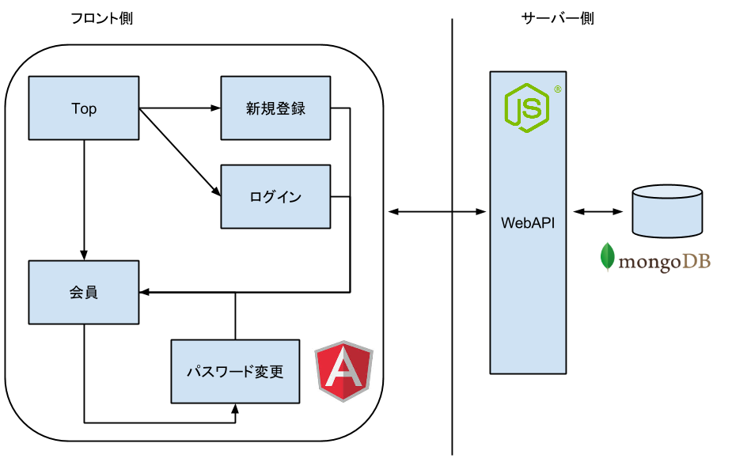
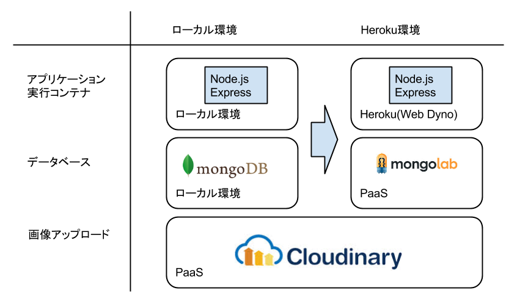

# 画像シェアサービスの仕様

画像シェアサービスの仕様について概要を説明します。  
アプリケーションのベースとなるものはangular-fullstack yeoman genereator(以下、genereator)でプロジェクト生成時に作成されています。

1. システム構成
2. 画面設計
3. DB設計
2. WebAPI一覧
3. アプリケーション構成

## 1. システム構成

画像シェアサービスはMEANスタックにて構成にて構成されています。

### MEANスタックとは

MEANスタックとは、Webアプリケーションを構築するために利用する技術スタックです。  
Node.jsを使った場合に良く利用する構成の頭文字を取って名前をつけたものです。

- __M__：MongoDB(データベース)
- __E__：Express(Node.jsのWebアプリケーションフレームワーク)
- __A__：AngularJS(Javascriptフレームワーク)
- __N__：Node.js(アプリケーション実行エンジン)

フロント側はAngularJSを利用したSPA(Single-page-application)で構築されており、サーバー側のデータはexpressを利用したWebAPIを介してやりとりします。  
データの永続化はmongoDBを使い、画像アップロード先として、Cloudinary(PaaSサービス)を利用しています。

概要は次の通りです。



### ローカル：Heroku対応表

Heroku上で動作する場合、一部のミドルウェアはHerokuの__アドオン__を利用します。  
対応表は次の通りです。



## 2. 画面設計

画面一覧は以下の通りです。

|画面名|URL|認証|概要|
| --- | --- | --- | --- |
| トップ | / |  | トップ画面。公開画像をカルーセルで表示する |
| ログイン | /login |  | ログイン画面 |
| 会員登録 | /signup |  | 新規会員登録画面 |
| パスワード変更 | /settings | 要 | パスワード変更画面 |
| 会員ページ | /me | 要 | 会員のプライベート画面。画像のアップロード・削除・公開設定ができる |

この中で会員ページ以外は、既にgenetatorでプロジェクト生成した時に作成されています。  
ハンズオンでは主に会員ページへ機能を追加していきます。

## 4. DB設計

DBの一覧は次の通りです。

| テーブル名 | 概要 |
| --- | --- |
| ユーザー | ユーザーを管理するテーブル |
| 写真 | アップロードした画像を管理するテーブル |

この中で写真テーブル以外は、既にgenetatorでプロジェクト生成した時に作成されています。  

写真テーブルの項目定義は次の通りです。

|項目名|概要|
| --- | --- |
| name | 画像名(今回は利用しません) |
| url | Cloudinary上の公開画像URL |
| publicId | Cloudinary上の公開画像ID |
| owner | 画像オーナー(Userテーブルとリレーションしています) |
| share | 公開可否フラグ |

## 5. WebAPI一覧

WebAPI一覧は次の通りです。

|URL|Method|認証|概要|
| --- | --- |--- | --- |
| auth/local | GET | | ログイン |
| users/ | POST | | 新規ユーザー登録 |
| users/me | GET | 要 | ログインユーザー情報取得 |
| users/:id/password | PUT | 要 | パスワード変更 |
| users/:id | POST | 要 | ユーザー情報取得 |
| photos/ | GET | | 公開画像取得 |
| photos/me | GET | 要 | プライベート画像取得 |
| photos/me | POST | 要 | 画像アップロード |
| photos/me/:id | PUT | 要 | 画像シェア設定変更 |
| photos/me/:id | DELETE | 要 | 画像削除 |

この中で`photos/`以外は、既にgenetatorでプロジェクト生成した時に作成されています。   
ハンズオンでは主に`photos/`配下のAPIへ機能を追加していきます。

## 6. アプリケーション構成

angular-fullstackのアプリケーション構成の概要を説明します。

詳細はこちらを参照してください。  
[DaftMonk/generator-angular-fullstack - project structure](https://github.com/DaftMonk/generator-angular-fullstack#project-structure)

### フロントエンド構成

フロント側のコードは`client`配下に存在しています。

```
├── client
│   ├── app                 - フロントエンド側のアプリケーション一式
│   ├── assets              - 画像ファイルなど静的リソース
│   ├── components          - 再利用可能なUIコンポーネント(ナビゲーションバーなど)
```
 
`client/app`配下には、コンポーネント化された各画面のコードが格納されています。
```
client/app/main
├── main.js                 - Routes(画面コンポーネントとURLマッピング)
├── main.controller.js      - Controller(ロジック)
├── main.controller.spec.js - Test
├── main.html               - View(テンプレート)
└── main.css                - Styles
```

###  バックエンド構成

バックエンド側のコードは`server`配下に存在しています。

```
└── server
    ├── api                 - APIコード一式
    ├── auth                - 認証系の共通部品
    ├── components          - 再利用可能なコンポーネント
    ├── config              - アプリの設定ファイル系
    │   └── local.env.js    - ローカル環境設定ファイル
    │   └── environment     - 各環境ごとの設定ファイル(dev, test, prod)
    └── views               - 画面(エラーページ)
```
 
`server/api`配下には、各APIの部品が配置されています。
```
server/api/thing
├── index.js                - Routes(APIとURLマッピング)
├── thing.controller.js     - Controller(ロジック)
├── thing.model.js          - Database model(エンティティ)
├── thing.socket.js         - Register socket events(今回は利用しません！)
└── thing.spec.js           - Test
```

----
[:point_right: 3. Herokuの準備とデプロイ](../03)

[:point_left: 1. 開発環境の準備](../01)  
