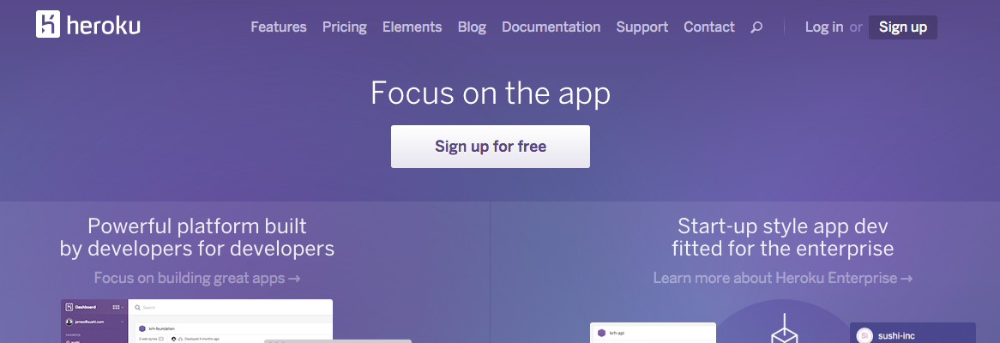
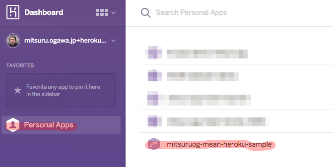
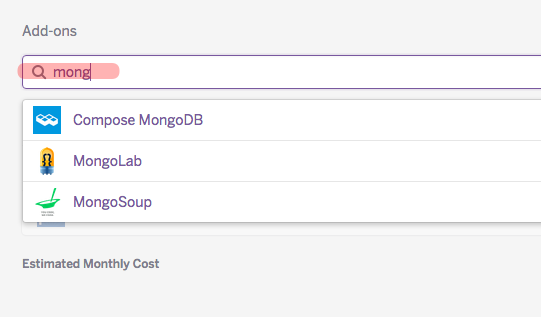
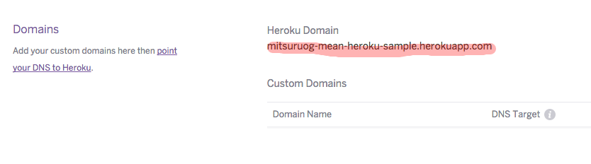
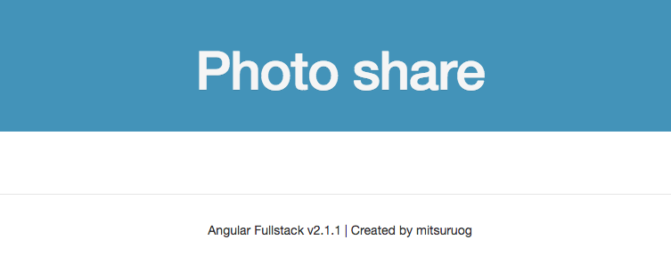

# Herokuの準備とデプロイ

早速、アプリケーションをHerokuにデプロイします。  
Herokuのアドオンの設定やコマンドラインからの操作方法について学習します。

1. Herokuアカウントの作成
1. HerokuToolbletのインストール
1. アプリケーションの作成
1. アドオンの追加
1. デプロイ&公開

## 1. Herokuアカウントの作成



まず、Herokuアカウントを作成します。

[Heroku | Cloud Application Platform](https://www.heroku.com/)

## 2. HerokuToolbletのインストール

続いて、HerokuをCLI(Command-line interface)から操作するための[Heroku Toolbelt](https://toolbelt.heroku.com/)をインストールします。

インストールが完了した場合は、CLI経由でHerokuにログインします。

```
heroku --version
> heroku-toolbelt/3.41.3 (x86_64-darwin10.8.0) ruby/1.9.3
> heroku-cli/4.21.5-e73672c (amd64-darwin) go1.4.2

heroku login
> Enter your Heroku credentials.
> Email: 
> Password (typing will be hidden): 
> Authentication successful.

# ログインしているアカウントを確認
heroku auth:whoami
```
## 3. アプリケーションの作成

続いてHeroku上で公開するためのアプリケーションを作成します。

- :warning: Heroku上では アプリケーション名を一意にする必要があります。重複しないような名前をつけてください。
- :warning: 初回はmongoDBのアドオンが設定されていないため、エラーとなります。
- :warning: エラーメッセージで提案される`heroku addons:add mongohq`は__有料プランのみ__ですので選択しないようご注意ください。

```
yo angular-fullstack:heroku
> ? Name to deploy as (Leave blank for a random name): 
> ? On which region do you want to deploy ? US

> Initializing deployment repo
> Initialized empty Git repository in /Users/mitsuruog/workspace/work/mean-heroku-sample2/dist/.git/

> Creating heroku app and setting node environment
> Creating ... 
> done, stack is cedar-14

...(省略)

>  create mode 100644 server/routes.js
>  create mode 100644 server/views/404.html

> Done, without errors.

> Uploading your initial application code.
>  This may take several minutes depending on your connection speed...

> Because you're using mongoose, you must add mongoDB to your heroku app.
> 	from `/dist`: heroku addons:add mongohq

> Your app should now be live. To view it run
> 	cd dist && heroku open

> You may need to address the issues mentioned above and restart the server for the app to work correctly.
> After app modification run
> 	grunt build
> Then deploy with
> 	grunt buildcontrol:heroku

```

:warning: `heroku`コマンドを実行する場合は、必ず`dist`フォルダで実行してください。

> :gift_heart: heroku上にアプリケーションを作成する時は、git管理されているディレクトリの下で`heroku create -app <application_name>`のコマンドを実行します。  
`-app <application_name>`の部分は省略可能です。省略した場合はHeroku上で名称が自動的に生成されます。

HerokuのDashboard上でアプリケーションが作成されていることを確認します。



## 4. アドオンの追加

:warning: アドインの利用の際にクレジット登録が必要になるかもしれません。。。

HerokuのDashboard上でアドオンを追加します。  
アドオンの追加はアプリケーション上の`Resources`タブから追加します。



ハンズオンでは次のアドオンを利用します。いずれも`Free`プランで結構です。

- MongoLab
- Papertrail
- Cloudinary

> :gift_heart: herokuにはWebサービス構築に必要な機能(ログ、監視、キャッシュ、DB、Email/SMS/Push、など)を__アドオン__と呼ばれるもので組み込める仕組みがあります。  
[Add-ons - Heroku Elements](https://elements.heroku.com/addons)  
`heroku addons:add <add-on名>`でコマンドラインからも追加が可能ですが、プランなどを確認できるためダッシュボード上のGUIで追加する方をオススメします。

> :gift_heart: アプリケーションに追加されているアドオンは`heroku addons`コマンドで確認することができます。

## 5. デプロイ&公開

ではHeroku上にデプロイします。  
その前に、Topページを少し変更しておきます。

__client/app/main/main.html__

```html
<div ng-include="'components/navbar/navbar.html'"></div>

<header class="hero-unit" id="banner">
  <div class="container">
    <h1>Photo Share</h1>
  </div>
</header>

<footer class="footer">
  <div class="container">
      <p>Angular Fullstack v2.1.1 |
        Created by [あなたの名前]
      </p>
  </div>
</footer>
```

変更したらherokuへデプロイします。

```
grunt build
grunt buildcontrol:heroku

> Running "buildcontrol:heroku" (buildcontrol) task

> Fetching master history from heroku.
> From https://git.heroku.com/mitsuruog-mean-sample
>  = [up to date]      master     -> heroku/master

> Committing changes to master.
> [master d43d4fc] Built mean-heroku-sample2 from commit (unavailable) on branch (unavailable)
>  3 files changed, 2 insertions(+), 2 deletions(-)
>  create mode 100644 public/app/787459fa.app.js
>  delete mode 100644 public/app/eee0da82.app.js

> Pushing master to heroku 
> remote: Compressing source files... done. 

...(省略)

> remote: 
> remote: Verifying deploy.... done.        
> To https://git.heroku.com/mitsuruog-mean-sample.git
>    30dbef4..d43d4fc  master -> master

> Done, without errors.

```

> :gift_heart: 既存のプロジェクトをheroku上のアプリケーションと紐づけるためには`heroku git:remote`コマンドを利用します。
```
heroku git:remote -a <アプリケーション名>
```

> :warning: デプロイ時に以下のエラーが発生する場合
```
Warning: fatal: 'heroku' does not appear to be a git repository  
fatal: Could not read from remote repository.  
```
`dist`配下のgitにherokuのリモートリポジトリが設定されていないことが原因です。  
`dist`直下で以下のコマンドを実行してください。  
```
heroku git:remote -a <アプリケーション名>
```
特に、既存のプロジェクトをgit cloneした際にherokuのリモートリポジトリが設定されておらず発生することが多いです。

HerokuのDashboardの`Settings`タブで、Heroku上の公開URLが確認できます。  
ブラウザ上でアクセスしてみてください。





> :gift_heart: heroku上でホストされたアプリケーションを開くためには`heroku open`コマンドが便利です。
```
heroku open --app <アプリケーション名>
```

> :gift_heart: herokuへのデプロイはgitコマンドで実行できるようになっています。  
これは`heroku create`した際にgit上に__heroku__という名前のリモートリポジトリが追加されているためです。  
そのため、通常は`git push heroku master`でアプリケーションのデプロイが可能です。

> :gift_heart: heroku上にデプロイされるアプリケーションは__slug__と呼ばれる形にアーカイブされます。  

> :gift_heart: slugを作成する際には各言語ごとの__buildpack__と呼ばれる仕組みを利用します。  
通常は、アプリケーションの構成を見て適用するbuildpackを自動判定するため、あまり意識する必要はありません。  
例えば、ルートディレクトリに`package.json`ファイルが存在する場合は、`node.js`と判定されます。  

> :gift_heart: buildpackの指定はカスタマイズが可能です。heroku createの実行時に`--buildpack`オプションで指定するか、`heroku buildpacks:set <BUILDPACK_URL>` を実行するかのどちらかで変更できます。

> :gift_heart: heroku上にslugファイルが送られると、実際にアプリケーションを起動するために実行コンテナを作成してheroku上のプロセスを割り当てる必要があります。  
これを指定するファイルが__Procfile__です。Procfileも次の記法に基づきカスタマイズか可能です。
```
Dynoキー名:プロセスを起動させるコマンド
ex) web: node server/app.js
```

----
[:point_right: 4. 共通機能の作成と事前準備](../04)

[:point_left: 2. 画像シェアサービスの仕様](../02)
