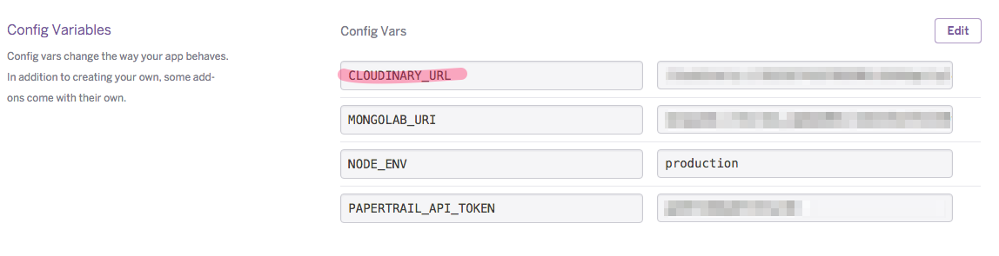
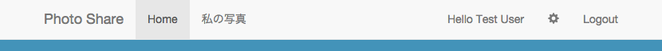
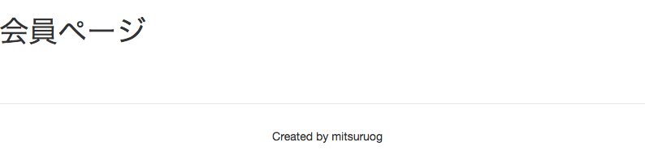

# 共通機能の作成と事前準備

以降の章で機能を追加する画面とAPIの雛形を作成します。  
それ以外にも細々とした機能を追加していきます。

1. サーバー側の事前準備
2. フロント側の事前準備

## 1. サーバー側の事前準備

### Photo API雛形の生成

generator機能を利用し、次章以降で利用する`Photo API`を自動生成します。

```
yo angular-fullstack:endpoint photo

> ? What will the url of your endpoint be? /api/photos
>    create server/api/photo/index.js
>    create server/api/photo/photo.controller.js
>    create server/api/photo/photo.model.js
>    create server/api/photo/photo.spec.js
```

`server/api/photo`配下にファイルが作成されていることを確認します。

### PhotoModelの作成

mondoDBとはODM(Object-Document-Mapper: RDBのORMと同じようなものです)[Mongoose](http://mongoosejs.com/)を利用します。

まずMongooseで利用するPhotoModelを作成します。

__server/api/photo/photo.model.js__
```diff
var mongoose = require('mongoose'),
    Schema = mongoose.Schema;

var PhotoSchema = new Schema({
  name: String,
-  info: String,
-  active: Boolean
+  url: String,
+  owner: {
+    type: Schema.Types.ObjectId,
+    ref: 'User'
+  },
+  publicId: String,
+  share: Boolean
});

module.exports = mongoose.model('Photo', PhotoSchema);
```

### Cloudinary共通サービスの作成

まず、CloudinaryAPIキーを確認します。  
CloudinaryAPIキーはHerokuのDashboardのSettingから確認することができます。



`server/config/local.env.sample.js`を同じフォルダにコピーしてください。  
`local.env.js`リネームして、CloudinaryAPIキーを設定します。

__local.env.js__
```diff
module.exports = {
  DOMAIN:           'http://localhost:9000',
  SESSION_SECRET:   'sample-secret',

+  CLOUDINARY_URL: '<あなたのAPIKey>',

  // Control debug level for modules using visionmedia/debug
  DEBUG: ''
};
```

:warning: `local.env.js`はセキュアな情報を保存するため、git上にcommitしないように注意してください。本リポジトリでは事故を防ぐため`.gitignore`に指定しています。

Cloudinary共通サービスモジュールを作成します。  

まず、CloudinaryのNode.js用SDKとアップロードされたファイルを扱うためのモジュールをインストールします。

```
npm install cloudinary connect-multiparty --save
```

続いて、`server/cloudinary/cloudinary.service.js`を作成します。

__server/cloudinary/cloudinary.service.js__

```js
var config = require('../config/environment');
var cloudinary = require('cloudinary');

// アップロード機能
function upload(file) {
  return cloudinary.uploader.upload(file);
}

// 画像削除機能
function remove(publicId) {
  return cloudinary.api.delete_resources([publicId]);
}

// 外部モジュールとして公開
exports.upload = upload;
exports.remove = remove;
```

> :gift_heart: Cloudinaryへの接続情報は、CloudinaryのNode.js用SDKが環境変数の`CLOUDINARY_URL`を参照して自動設定するようになっています。  
[cloudinary/cloudinary_npm - configuration](https://github.com/cloudinary/cloudinary_npm#configuration)

> :gift_heart: angular-fullstack上はexpressサーバ起動時に`grunt-env`が`server/config/local.env.sample.js`の内容を環境変数へバインドする仕組みを持っています。

## 2. フロント側の事前準備

### ナビゲーションバーへ会員ページへのリンク追加

画面上部に表示されるナビゲーションバーに会員ページへのリンクを追加します。  
このリンクはログイン後に表示できるようにします。  

`NavbarCtrl`には`isLoggedIn`というログイン済みかどうかを判定する関数がすでに存在するため、それをそのまま利用します。

__client/components/navbar/navbar.html__

```diff
<div class="navbar navbar-default navbar-static-top" ng-controller="NavbarCtrl">
  <div class="container">

    ...
    
    <div collapse="isCollapsed" class="navbar-collapse collapse" id="navbar-main">
      <ul class="nav navbar-nav">
        <li ng-repeat="item in menu" ng-class="{active: isActive(item.link)}">
            <a ng-href="{{item.link}}">{{item.title}}</a>
        </li>
+        <li ng-show="isLoggedIn()">
+          <a ng-href="/me">私の写真</a>
+        </li>
        <li ng-show="isAdmin()" ng-class="{active: isActive('/admin')}"><a href="/admin">Admin</a></li>
      </ul>

      ...
      
    </div>
  </div>
</div>
```

ログイン後に会員ページのリンクが表示されます。



### 会員ページ雛形の生成

generator機能を利用し、次章以降で利用する会員ページを自動生成します。

```
yo angular-fullstack:route me

> ? Where would you like to create this route? client/app/
> ? What will the url of your route be? /me
>    create client/app/me/me.js
>    create client/app/me/me.controller.js
>    create client/app/me/me.controller.spec.js
>    create client/app/me/me.css
>    create client/app/me/me.html
```

`client/app/me`直下にファイルが作成されていることを確認します。

続いて、会員ページを次のように変更して、変更後の画面が表示されることを確認します。

__client/app/me/me.html__

```diff
- <div class="col-md-12">
-    This is the me view.
- </div>
+ <div ng-include="'components/navbar/navbar.html'"></div>

+ <!-- 以降はここを編集していきます -->
+ <h1>会員ページ</h1>

+ <footer class="footer">
+     Created by [あなたの名前]
+ </footer>
```

<http://localhost:9000/me> にアクセスすると会員ページが表示されます。



----
[:point_right: 5. 画像アップロード機能の作成](../05)

[:point_left: 3. Herokuの準備とデプロイ](../03)
