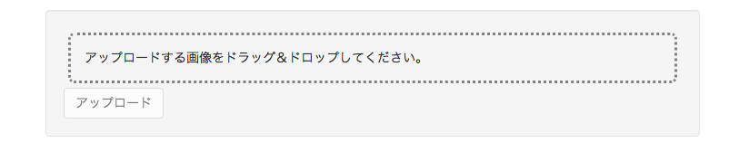
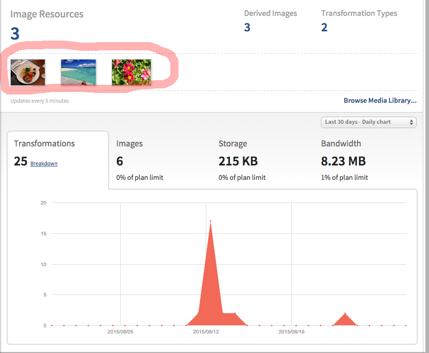

# 画像アップロード機能の作成

画像アップロード機能を追加します。  
サーバー側にAPIを作成し、会員ページのアップロードボタンを設置してアップロード処理を追加していきます。

1. サーバー側ルーターの設定
4. サーバー側Controllerの作成
5. フロント側ルーターの設定
6. 会員ページへアップロードボタンを追加
7. フロント側Controller作成
7. Herokuへデプロイ

## サーバー側ルーターの設定

サーバー側のルーターにて機能とURLをマッピングします。

__server/api/photo/index.js__

```diff
var express = require('express');
var controller = require('./photo.controller');

+ // 認証モジュールを追加します
+ var auth = require('../../auth/auth.service');

+ // アップロード画像を取り扱うモジュールを追加します
+ var multiparty = require('connect-multiparty');
+ var multipartyMiddleware = multiparty();

var router = express.Router();

+ // `/me`と`controller.upload`をマッピングします
+ // multipartyMiddlewareを経由することで、アップロードファイルをControllerにて取り扱う形に変換することができます
+ router.post('/me', auth.isAuthenticated(), multipartyMiddleware, controller.upload);

- router.get('/', controller.index);
- router.get('/:id', controller.show);
- router.post('/', controller.create);
- router.put('/:id', controller.update);
- router.patch('/:id', controller.update);
- router.delete('/:id', controller.destroy);

module.exports = router;
```

## サーバー側Controllerの作成

### 画像アップロードAPI作成

続いて、Controller側の処理を記述します。  
cloudinaryに画像アップロードした際のレスポンスは次のようなものが返却されます。

```js
{ 
  public_id: 'sample',
  version: 1312461204,
  width: 864,
  height: 576,
  format: 'jpg',
  bytes: 120253,
  url: 'http://res.cloudinary.com/demo/image/upload/v1371281596/sample.jpg',
  secure_url: 'https://res.cloudinary.com/demo/image/upload/v1371281596/sample.jpg' 
}
```

__server/api/photo/photo.controller.js__

```diff
var _ = require('lodash');
var Photo = require('./photo.model');

+ // cloudinary共通サービスを追加します
+ var cloudinary = require('../../cloudinary/cloudinary.service');

+ // 写真をアップロード
+ exports.upload = function(req, res) {

+   // アップロードされたファイルはmultipartyMiddlewareを経由して
+   // req.files.fileにバンドルされています
+   if(req.files.file) {

+     var file = req.files.file.path;

+     // Cloudinary上に写真をアップロード
+     cloudinary.upload(file).then(function(result){

+       // PhotoModelを作成します
+       var photo = new Photo();
      
+       // 認証済みユーザの情報はreq.userにバンドルされています
+       photo.owner = req.user.id;
+       photo.name = result.version;
+       photo.url = result.url;
+       photo.publicId = result.public_id;

+       // mondoDBへ追加します
+       Photo.create(photo, function(err, photo) {
+         if(err) { return handleError(res, err); }
+         // 作成結果を返します
+         return res.status(201).json(photo);
+       });

+     });

+  }

- 自動生成されたコントローラの関数全て

function handleError(res, err) {
  return res.status(500).send(err);
}

```

以上でサーバー側の準備は完了です。

## フロント側ルーターの設定

会員ページへ認証フイルタを設定します。

> :gift_heart: angular-fullstackには、既にフロント側の認証モジュールが含まれているため、フロント側のルーターに認証フィルターを設定することで簡単に認証が必要なページを実現することができます。  

__client/app/me/me.js__

```diff
'use strict';

angular.module('sampleApp')
  .config(function ($stateProvider) {
    $stateProvider
      .state('me', {
        url: '/me',
        templateUrl: 'app/me/me.html',
        controller: 'MeCtrl',
+        // 認証フィルターを設定します
+        authenticate: true
      });
  });
```

これで、ログインしていない状態で`http://localhost:9000/me`にアクセスすると、ログイン画面が表示されるようになります。

## 会員ページへアップロードボタンを追加

ファイルのアップロードには[danialfarid/ng-file-upload](https://github.com/danialfarid/ng-file-upload)を利用します。 
まず、`ng-file-upload`モジュールを追加します。

```
bower install --save ng-file-upload
```

追加したモジュールを有効にするため、トップレベルのアプリケーションに依存関係を追加します。

__client/app/app.js__

```diff
angular.module('photoShareApp', [
  'ngCookies',
  'ngResource',
  'ngSanitize',
  'ui.router',
  'ui.bootstrap',
+   'ngFileUpload'  // ここにモジュールを追加します
])
```

続いて、会員ページにアップロード用のエリアを追加します。  

__client/app/me/me.html__

```diff

<!-- 以降はここを編集していきます -->
- <h1>会員ページ</h1>

+ <div class="container">
+   <div class="well">
+     <!-- ファイルをドラッグ＆ドロップするエリア -->
+     <div ngf-drop ngf-select ng-model="file" class="drop-box"
+          ngf-multiple="false" ngf-allow-dir="false" ngf-accept="'image/*'">
+          アップロードする画像をドラッグ＆ドロップしてください。</div>
+     <!-- HTML5 File APIがサポートされていない場合に表示される -->
+     <div ngf-no-file-drop>このブラウザではドラッグ＆ドロップがサポートされていません。</div>
+     <!-- アップロードするファイルのプレビュー表示 -->
+     
+     <!-- アップロード処理を行うボタン -->
+     <div>
+       <button type="button" class="btn btn-default" ng-click="upload(file)" n+ g-disabled="!file">アップロード</button>
+     </div>
+   </div>
+ </div>

```

> :gift_heart: 細かな要素の説明は次の通りです。
- ngf-drop:ドラッグ&ドロップでアップロードファイルを選択できるようになります。
- ngf-select:要素をクリックするとファイル選択できるようになります。
- ngf-multiple:ファイルの複数選択を有効にします。
- ngf-allow-dir:フォルダ単位のアップロードを有効にします。
- ngf-accept:有効なファイルフォーマットを指定します。
- ngf-no-file-drop:ブラウザがHTML5 File APIをサポートしていない場合に表示されます。
- ngf-src:プレビューの参照先プロパティです。

アップロードエリアのスタイルを微調整するため、スタイルを追加します。

__client/app/me/me.css__

```css
.drop-box {
  margin: 5px;
  padding: 15px;
  border: dotted 3px gray;
  border-radius: 7px;
}

.preview-box {
  max-height: 400px;
  margin: 7px;
}
```

## フロント側Controller作成

続いてControllerに画像アップロード機能を追加します。  
`ng-model="file"`に設定されている通り、アップロードされたファイルはフロント側のコントローラで`file`というプロパティで参照することが可能です。  

__client/app/me/me.controller.js__

```diff
angular.module('photoShareApp')
-   .controller('MeCtrl', function ($scope) {
+  .controller('MeCtrl', function ($scope, Upload) { // Uploadを追加します

-    $scope.message = 'Hello';

+    // アップロード画像を保持するプロパティ
+    $scope.photos = [];

+    $scope.upload = function (file) {
+      if(file) {
+        Upload.upload({
+          url: '/api/photos/me',
+          method: 'POST',
+          file: file
+        }).success(function (data, status, headers, config) {
+          // アップロードが完了した場合、リストに追加します。
+          $scope.photos.push(data);
+          // 成功した場合はファイルを削除します。
+          $scope.file = null;
+        }).error(function (data, status, headers, config) {
+          console.log('error status: ' + status);
+        });
+      }
+    };

  });
```

以上でアップロード機能は完成です。
ログインした状態でアクセスすると、次のような画面が表示されるはずです。



また、アップロード画像はCloudinaryのダッシュボードにて確認することができます。



> :gift_heart: Herokuのアドオンはそれぞれ独立したサービスとなっており、Herokuのアドオンのリンクをクリックすることで、各サービスへSSOすることができます。


## Herokuへデプロイ

ローカルでの動作確認が終わったら、heroku上にデプロイしましょう。  
アプリケーションをherokuへデプロイします。

```
grunt build
grunt buildcontrol:heroku
```

デプロイされた画面を確認してください。

----
[:point_right: 6. アップロード画像サムネイルの作成](../06)

[:point_left: 4. 共通機能の作成と事前準備](../04)
