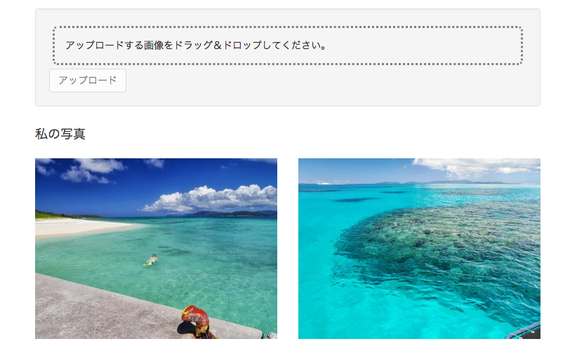

# アップロード画像サムネイルの作成

会員ページにアップロードした画像のサムネイルを追加します。

1. サーバー側ルーターの設定
2. サーバー側Controllerの作成
3. 会員ページにサムネイル追加
4. フロント側Controller作成
5. Herokuへデプロイ

## サーバー側ルーターの設定

まず、サーバー側のルーターでURLと機能をマッピングします。

__server/api/photo/index.js__

```diff
var express = require('express');
var controller = require('./photo.controller');
var auth = require('../../auth/auth.service');

var multiparty = require('connect-multiparty');
var multipartyMiddleware = multiparty();

var router = express.Router();

router.post('/me', auth.isAuthenticated(), multipartyMiddleware, controller.upload);

+ // `/me`と`controller.showPrivate`をマッピングします
+ // URLと機能の間にauth.isAuthenticated()を経由させることで、
+ // 認証していないアクセスをフィルタリングします
+ router.get('/me', auth.isAuthenticated(), controller.showPrivate);

module.exports = router;
```

## サーバー側Controllerの作成

続いてController側にプライベート画像取得APIを追加します。

__server/api/photo/photo.controller.js__

```diff

exports.upload = function(req, res) { ... }

+ // プライベートな写真を取得
+ exports.showPrivate = function(req, res) {
+  Photo.find({
+    owner: req.user._id // 自分の画像のみ取得します
+  }, function (err, photos) {
+    if(err) { return handleError(res, err); }
+    // 取得した画像を返します
+    return res.status(200).json(photos);
+  });
+ };

...
```
> :gift_heart: 認証済みユーザーの情報はangular-fullstack上の認証フィルタを経由することで`req.user`にバンドルされています。

## 会員ページにサムネイル追加

続いて、会員ページにアップロード画像を表示するサムネイルを追加します。

__client/app/me/me.html__

```diff
<div class="container">
  <!-- ここはアップロードエリア -->
</div>

+ <!-- ここはサムネイルエリア -->
+ <div class="container">
+   <h4>私の写真</h4>
+   <div class="row">
+     <div class="col-xs-6 col-md-3" ng-repeat="photo in photos">
+       
+     </div>
+   </div>
+ </div>

```

> :gift_heart: `ng-repeat`はAngularJSのビルトインディレクティブです。コントローラの特定のプロパティに対して繰り返し処理を行うことができます。 
[AngularJS: API: ngRepeat](https://code.angularjs.org/1.3.17/docs/api/ng/directive/ngRepeat)

## フロント側Controller作成

続いてControllerにプライベート画像取得機能を追加します。

__client/app/me/me.controller.js__

```diff
module('photoShareApp')
-  .controller('MeCtrl', function ($scope, Upload) {
+  .controller('MeCtrl', function ($scope, $http, Upload) {

    $scope.upload = function (file) {
      ...
    };

+     // 初期表示時に画像を取得します
+     $http.get('/api/photos/me').success(function (photos) {
+       $scope.photos = photos;
+     });

  });
```

以上で会員ページへのサムネイル追加は完了しました。  
画面は次のようになります。



## Herokuへデプロイ

アプリケーションをherokuへデプロイします。

```
grunt build
grunt buildcontrol:heroku
```

デプロイされた画面を確認してください。

----
[:point_right: 7. 画像削除機能の作成](../07)

[:point_left: 5. 画像アップロード機能の作成](../05)  
