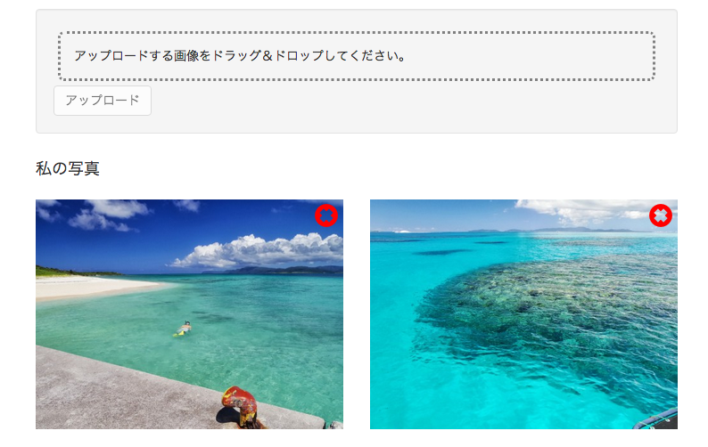

# 画像削除機能の作成

会員ページにアップロード画像の削除機能を追加します。

1. サーバー側ルーターの設定
2. サーバー側Controllerの作成
3. 会員ページへ削除ボタン追加
4. フロント側Controller作成
5. Herokuへデプロイ

## サーバー側ルーターの設定

まず、サーバー側のルーターでURLと機能をマッピングします。

__server/api/photo/index.js__

```diff
var express = require('express');
var controller = require('./photo.controller');
var auth = require('../../auth/auth.service');

var multiparty = require('connect-multiparty');
var multipartyMiddleware = multiparty();

var router = express.Router();

router.post('/me', auth.isAuthenticated(), multipartyMiddleware, controller.upload);
router.get('/', controller.showPublic);
router.get('/me', auth.isAuthenticated(), controller.showPrivate);

+ // `/me/:id`と`controller.destroy`をマッピングします
+ // :idはURLのパスをパラメータとして解釈するものです
+ // ex) api/photos/me/1 => id=1
+ router.delete('/me/:id', auth.isAuthenticated(), controller.destroy);

module.exports = router;
```

## サーバー側Controllerの作成

続いてController側に削除機能を追加します。

__server/api/photo/photo.controller.js__

```diff

exports.upload = function(req, res) { ... }
exports.showPublic = function(req, res) { ... }

+ // 写真を削除
+ exports.destroy = function(req, res) {

+    // 写真をIDで検索します
+   Photo.findById(req.params.id, function (err, photo) {
  
+     if(err) { return handleError(res, err); }
+     if(!photo) { return res.status(404).send('Not Found'); }

+     // Cloudinary上から写真を削除
+     cloudinary.remove(photo.publicId).then(function() {

+       // mondoDB上からも写真を削除
+       photo.remove(function(err) {
+         if(err) { return handleError(res, err); }
+         // 削除結果を返します
+         return res.status(204).send('No Content');
+       });
      
+     });
+   });

};
```

以上でサーバー側の準備は完了です。

## 会員ページへ削除ボタン追加

会員ページのサムネイルに画像削除ボタンを追加します。  
削除ボタンをクリックした際に、フロント側コントローラの`deletePhoto()`を呼び出すようにします。

__client/app/me/me.html__

```diff
<div class="container">
  <!-- アップロードエリア -->
</div>

<!-- サムネイルエリア -->
<div class="container">
  <h4>私の写真</h4>
  <div class="row">
    <div class="col-xs-6 col-md-3 photo" ng-repeat="photo in photos">
+       <!-- 削除ボタンを追加 -->
+       <div class="photo-button photo-button-delete" ng-click="deletePhoto(photo)">
+        <span class="glyphicon glyphicon-remove-sign"></span>
+       </div>
      
    </div>
  </div>
</div>
```

画像の右上にボタンが表示されるよう、スタイルを追加します。

__client/app/me/me.css__

```css
.photo-button {
  font-size: 26px;
}

.photo-button-delete {
  position: absolute;
  top: 17px;
  right: 21px;
  color: red;
}
```

次のような画面になります。



## フロント側Controller作成

続いてControllerに削除機能を追加します。

__client/app/me/me.controller.js__

```diff
angular.module('photoShareApp')
  .controller('MeCtrl', function ($scope, $http, Upload) {

    $scope.upload = function (file) {
      ...
    };

+    $scope.deletePhoto = function (photo) {
+      $http.delete('/api/photos/me/' + photo._id).success(function () {
+        // 削除が完了した場合、リストから削除します。
+        var index = $scope.photos.indexOf(photo);
+        $scope.photos.splice(index, 1);
+      });
+    };

  });
```

以上でアップロードした画像を削除することができました。

## Herokuへデプロイ

では、アプリケーションをherokuへデプロイします。

```
grunt build
grunt buildcontrol:heroku
```

デプロイされた画面を確認してください。

----
[:point_right: 8. 画像シェア機能の作成](../08)

[:point_left: 6. アップロード画像サムネイルの作成](../06)  
