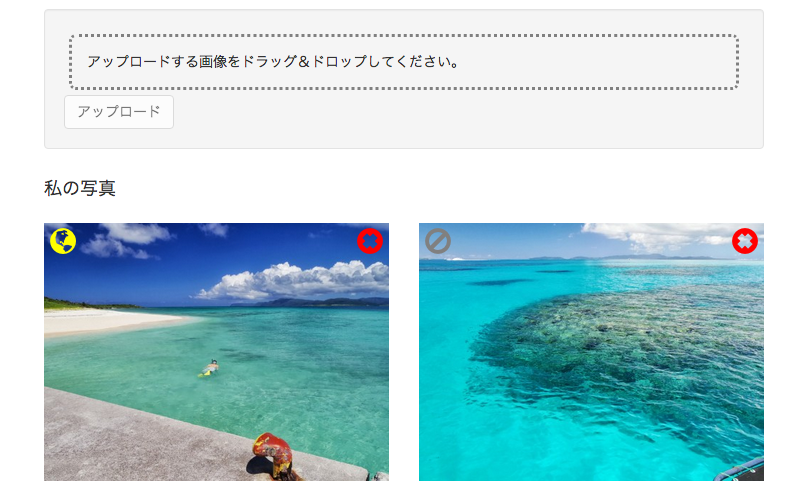
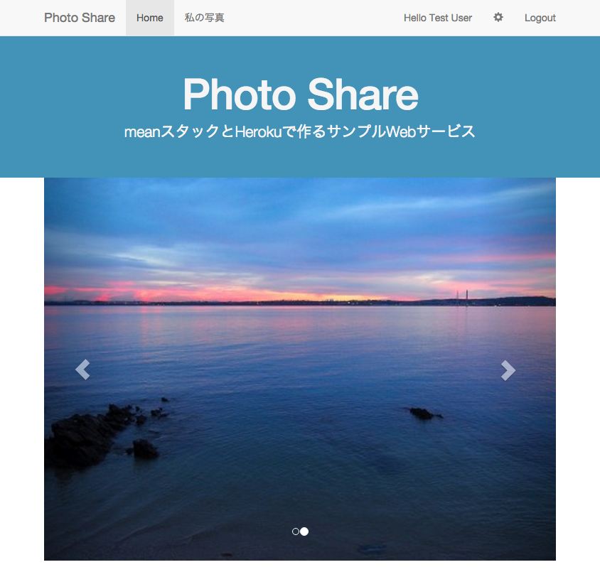

# 画像シェア機能の作成

会員ページに画像シェア機能を追加します。  
また、Topページに公開画像を表示するためのカルーセルを追加します。

1. サーバー側ルーターの設定
2. サーバー側Controllerの作成
3. 会員ページへ画像シェアボタン追加
4. 会員ページのフロント側Controller作成
5. Topページにシェア画像カルーセル追加
6. Topページのフロント側Controller作成
7. Herokuへデプロイ

## サーバー側ルーターの設定

まず、サーバー側のルーターでURLと機能をマッピングします。

__server/api/photo/index.js__

```diff
var express = require('express');
var controller = require('./photo.controller');
var auth = require('../../auth/auth.service');

var multiparty = require('connect-multiparty');
var multipartyMiddleware = multiparty();

var router = express.Router();

router.post('/me', auth.isAuthenticated(), multipartyMiddleware, controller.upload);
router.get('/me', auth.isAuthenticated(), controller.showPrivate);
router.delete('/me/:id', auth.isAuthenticated(), controller.destroy);

+ // `/`と`controller.showPublic`をマッピングします。
+ // シェア画像取得は認証の必要がありません。
+ router.get('/', controller.showPublic);

+ // `/me/:id`と`controller.changeState`をマッピングします
+ router.put('/me/:id', auth.isAuthenticated(), controller.changeState);

module.exports = router;
```

## サーバー側Controllerの作成

続いてController側に画像シェアAPIとシェア画像取得APIを追加します。

__server/api/photo/photo.controller.js__

```diff
exports.upload = function(req, res) { ... }
exports.showPrivate = function(req, res) { ... }

+ // 画像のシェア状況を変更します
+ exports.changeState = function(req, res) {
  
+    // 画像をIDで検索します
+   Photo.findById(req.params.id, function (err, photo) {
  
+     if(err) { return handleError(res, err); }
+     if(!photo) { return res.status(404).send('Not Found'); }

+     // ステータスを変更します
+     photo.share = !photo.share;
    
+     // mondoDB上へ変更を反映します
+     photo.save(function(err) {
+       if(err) { return handleError(res, err); }
+       // 変更結果を返します 
+       return res.status(200).send(photo);
+     });

+   });

+ }

+ // シェアされた画像を取得
+ exports.showPublic = function(req, res) {

+   Photo.find({
+     share: true // 条件に共有可を設定します
+   }, function (err, photos) {
+     if(err) { return handleError(res, err); }
+     // 取得した画像を返します
+     return res.status(200).json(photos);
+   });

+ };

```

以上でサーバー側の準備は完了です。

## 会員ページへ画像シェアボタン追加

続いて、会員ページのサムネイルにシェアボタンを追加します。  
シェアボタンをクリックした際に、フロント側コントローラのsharePhoto()を呼び出すようにします。

__client/app/me/me.html__

```diff
<div class="container">
  <!-- アップロードエリア -->
</div>

<!-- サムネイルエリア -->
<div class="container">
  <h4>私の写真</h4>
  <div class="row">
    <div class="col-xs-6 col-md-3 photo" ng-repeat="photo in photos">
      <!-- 削除ボタン -->
      <div class="photo-button photo-button-delete" ng-click="deletePhoto(photo)">
       <span class="glyphicon glyphicon-remove-sign"></span>
      </div>
+       <!-- シェアボタン -->
+       <div class="photo-button btn-share" ng-click="sharePhoto(photo)">
+         <!-- 画像のシェア状況に応じてアイコンを変化させます -->
+         <span class="glyphicon"
+           ng-class="{
+             'glyphicon-globe': photo.share,
+             'glyphicon-ban-circle': !photo.share,
+             'is-public': photo.share,
+             'is-private': !photo.share
+           }"
+         ></span>
+       </div>
      <!-- アップロード画像 -->
      
    </div>
  </div>
</div>
```

画像の左上にボタンが表示されるよう、スタイルを追加します。

__client/app/me/me.css__

```css
.btn-share {
  position: absolute;
  top: 17px;
  left: 21px;
}

.is-public {
  color: yellow;
}

.is-private {
  color: grey;
}
```

## 会員ページのフロント側Controller作成

続いてControllerにシェア機能を追加します。

__client/app/me/me.controller.js__

```diff
angular.module('photoShareApp')
  .controller('MeCtrl', function ($scope, $http, Upload) {

    $scope.upload = function (file) {
      ...
    };

    $scope.deletePhoto = function (photo) {
      ...
    };
    
+     $scope.sharePhoto = function(photo) {
+       $http.put('/api/photos/me/' + photo._id).success(function (data) {
+         // シェア状態をリストへ反映します。
+         var index = $scope.photos.indexOf(photo);
+         $scope.photos[index] = data;
+       });
+     };

  });
```

以上で会員ページの準備は完了しました。画面は次のようになります。  
画像のシェア状況に応じてアイコンと色が変化します。



## Topページにシェア画像カルーセル追加

最後はシェア画像をTopページに表示するためのカルーセルを追加します。  
カルーセルはui-bootstrapのコンポーネントを利用します。

<https://angular-ui.github.io/bootstrap/#/carousel>

__client/app/main/main.html__

```diff
<header class="hero-unit" id="banner">
  ...
</header>

- <div class="container">
-   <div class="row">
-     <div class="col-lg-12">
-       <h1 class="page-header">Features:</h1>
-       <ul class="nav nav-tabs nav-stacked col-md-4 col-lg-4 col-sm-6" ng-repeat="thing in awesomeThings">
-         <li><a href="#" tooltip="{{thing.info}}">{{thing.name}}</a></li>
-       </ul>
-     </div>
-   </div>
- </div>

+ <!-- シェア画像を表示するカルーセルエリア -->
+ <div class="container">
+   <carousel interval="2000" no-wrap="false">
+     <slide ng-repeat="photo in photos" active="photo.active">
+       
+       <div class="carousel-caption">
+         <p>{{slide.name}}</p>
+       </div>
+     </slide>
+   </carousel>
+ </div>

<footer class="footer">
  ...
</footer>
```

## Topページのフロント側Controller作成

続いてControllerにシェア画像取得機能を追加します。

__client/app/main/main.controller.js__

```diff
angular.module('photoShareApp')
  .controller('MainCtrl', function ($scope, $http) { 

-     $scope.awesomeThings = [];

-     $http.get('/api/things').success(function(awesomeThings) {
-       $scope.awesomeThings = awesomeThings;
-     });

-     $scope.addThing = function() {
-       if($scope.newThing === '') {
-         return;
-       }
-       $http.post('/api/things', { name: $scope.newThing });
-       $scope.newThing = '';
-     };

-     $scope.deleteThing = function(thing) {
-       $http.delete('/api/things/' + thing._id);
-     };
    
+     // シェア画像を保持するプロパティ
+     $scope.photos = [];

+     // シェア画像を取得します
+     $http.get('/api/photos').success(function(photos) {
+       $scope.photos = photos;
+     });

  });
```

以上でTopページへのカルーセル追加は完了しました。画面は次のようになります。  
会員ページにて画像をシェアするとカルーセルに表示することができます。



## Herokuへデプロイ

では、アプリケーションをherokuへデプロイします。

```
grunt build
grunt buildcontrol:heroku
```

デプロイされた画面を確認してください。

----
[:point_right: 9. 仕上げ](../09)

[:point_left: 7. アップロード画像作成機能の作成](../07)
